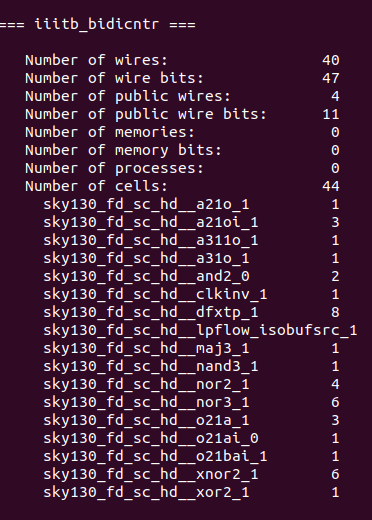
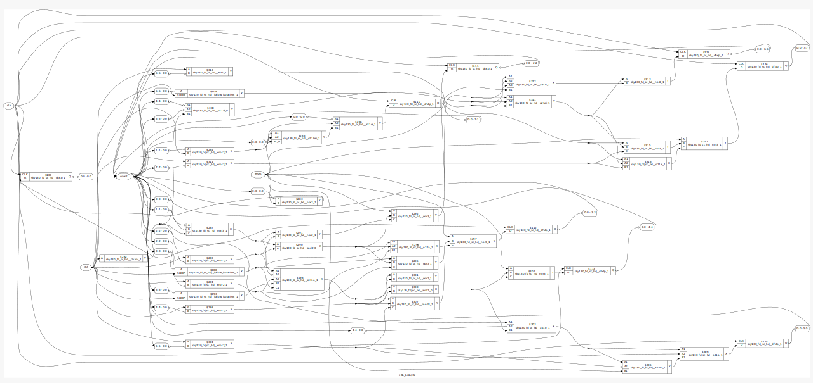

# iiitb_bidicntr- Bidirectional Counter

## Description

Both Synchronous and Asynchronous counters are capable of counting “Up” or counting “Down”, but their is another more “Universal” type of counter that can count in both directions either Up or Down depending on the state of their input control pin and these are known as Bidirectional Counters.
Bidirectional counters, also known as Up/Down counters, are capable of counting in either direction through any given count sequence and they can be reversed at any point within their count sequence by using an additional control input as shown below.

*Note: Circuit requires further optimization to improve performance. Design yet to be modified.*

## Application of Bidirectional Counter

Bidirectional counter has various applications
- *Up Counter*
- *Down Counter*
- *Analog to Digital converter*

## Bidirectional Counter - Verilog Implementation 
The digital circuit takes clock, ctrl and reset as input. It operates as  8-bit up counter when ctrl=1 and as  8-bit down cpunter when ctrl=0. The port description of the Bidirectional counter is shown in Table below. 


| PORT NAME | PORT TYPE | DESCRIPTION |
|-----------|-----------|-------------|
| clk       | input     | Clock Input |
| ctrl | input | to specify whether up or down counter |
| reset | input | Resets the counter to 0 |
| count[7:0] | output | 8-bit counter output |

## About iverilog 
Icarus Verilog is an implementation of the Verilog hardware description language.
## About GTKWave
GTKWave is a fully featured GTK+ v1. 2 based wave viewer for Unix and Win32 which reads Ver Structural Verilog Compiler generated AET files as well as standard Verilog VCD/EVCD files and allows their viewing

### Installing iverilog and GTKWave

#### For Ubuntu

Open your terminal and type the following to install iverilog and GTKWave:
```
$   sudo apt-get install git 
$   sudo apt get update
$   sudo apt get install iverilog gtkwave
```


### Functional Simulation
To clone the Repository and download the Netlist files for Simulation, enter the following commands in your terminal.
```
$   sudo apt install -y git
$   git clone https://github.com/Pankaj1811/iiitb_bidicntr
$   cd iiitb_bidicntr
$   iverilog iiitb_bidicntr.v iiitb_bidicntr_tb.v
$   ./a.out
$   gtkwave updown.vcd
```
#  Synthesis
The software used to run gate level synthesis is Yosys. Yosys is a framework for Verilog RTL synthesis. It currently has extensive Verilog-2005 support and provides a basic set of synthesis algorithms for various application domains. Yosys can be adapted to perform any synthesis job by combining the existing passes (algorithms) using synthesis scripts and adding additional passes as needed by extending the Yosys C++ code base. [^5]

```
git clone https://github.com/YosysHQ/yosys.git
make
sudo make install 
make test
```

The commands to run synthesis in yosys are given below. First create an yosys script `yosys_run.sh` and paste the below commands.
```
read_liberty -lib lib/sky130_fd_sc_hd__tt_025C_1v80.lib
read_verilog iiitb_bidicntr.v
synth -top iiitb_bidicntr	
dfflibmap -liberty lib/sky130_fd_sc_hd__tt_025C_1v80.lib
abc -liberty lib/sky130_fd_sc_hd__tt_025C_1v80.lib
clean
flatten
write_verilog -noattr iiitb_bidicntr_synth.v
stat
show
```
Then, open terminal in the folder iiitb_gc and type the below command.
```
yosys -s yosys_run.sh
```
## Post synthesis simulation
- Stats


- This is how layout is looking at first glance before proper placement



- GTKWAVE simulation


## Contributors

- **Pankaj Agrawal**
- **Kunal Ghosh**
- **Tejas B N**


## Acknowledgments


- Kunal Ghosh, Director, VSD Corp. Pvt. Ltd.
- Madhav Rao, Associate Professor, IIIT Bangalore
- V N Muralidhara, Associate Professor, IIIT Bangalore


## Contact Information

- Pankaj Agrawal, Postgraduate Student, International Institute of Information Technology, Bangalore  1811pankajagrawal@gmail.com
- Kunal Ghosh, Director, VSD Corp. Pvt. Ltd. kunalghosh@gmail.com
- Tejas B N, Postgraduate Student, International Institute of Information Technology, Bangalore  bntejas@gmail.com


## *References*
[^1]: Varun Akula, Dr. Vishwani D. Agrawal, James J. Danaher. [Comparison of power consumption of 4-bit binary counters with various state encodings including gray and one-hot codes](https://www.eng.auburn.edu/~vagrawal/COURSE/E6270_Spr15/PROJECT/REPORTS/Varun%20Akula%20Project%20Report.pdf). Auburn University

[^2]: [8-bit Gray Counter](https://www.intel.com/content/www/us/en/support/programmable/support-resources/design-examples/horizontal/ver-gray-counter.html) from INTEL FPGA Support Resources for the verilog design of gray counter.

[^3]: Icarus Verilog - [iverilog](http://iverilog.icarus.com/)

[^4]: GTK Wave [documentation](http://gtkwave.sourceforge.net/gtkwave.pdf)
